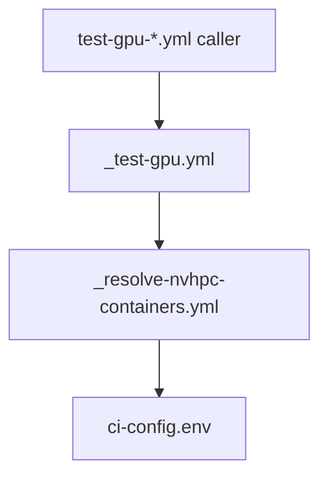

# MPAS-Model CI — Agent Reference Guide

## What is MPAS?

MPAS (Model for Prediction Across Scales) is a community atmospheric model used for weather forecasting and climate research. Scientific validity is non-negotiable — every CI change must preserve the correctness of model results and not hide failures.

MPAS has consistent coding conventions maintained over many years. Follow existing style.

## Who this guide is for

- **Students / new contributors** — Start with [Subset workflows](#subset-workflows-primary-ci) and the [test-* caller](#subset-workflows-primary-ci) you care about. Change compiler/MPI by picking a different caller or inputs; do not edit reusable templates until you understand the flow.
- **Scientists** — Namelist and physics settings live in test-case archives and `ci-config.env` (`ECT_*`, `BFB_*`). CI may override **`config_run_duration`** for short runs; **`config_dt`** is not changed by our profiling workflows (science-controlled per resolution).
- **Software engineers** — See [docs/ci-workflow-map.md](../docs/ci-workflow-map.md) for the full caller → reusable → composite map, [docs/ci-template-notes.md](../docs/ci-template-notes.md) for porting patterns to other NCAR repos, and the workflow graph below.

## Repository Layout

This is `NCAR/MPAS-Model-CI`, a fork of `MPAS-Dev/MPAS-Model`. The MPAS source code (Fortran, `src/`, `Makefile`) is inherited from upstream. CI infrastructure lives in `.github/`.

```
.github/
├── ci-config.env                # Central CI configuration (containers, flags, mappings)
├── copilot-instructions.md      # MPAS Fortran coding standards for AI assistants
├── data/
│   └── ect_excluded_vars.txt    # ECT variable exclusion list (PyCECT)
├── actions/
│   ├── build-mpas/              # Compiles MPAS-A for a given compiler
│   ├── checkout-mpas-source/    # Cross-repo checkout with CI overlay
│   ├── download-testdata/       # Downloads + caches test case archives
│   ├── resolve-container/       # Resolves container image from ci-config.env
│   ├── run-mpas/                # Configures and runs MPAS-A
│   ├── run-perturb-mpas/        # Runs perturbed ensemble members for ECT
│   │   ├── perturb_theta.py     # IC perturbation (theta field)
│   │   └── trim_history.py      # Trims history files for artifact upload
│   ├── validate-ect/            # PyCECT validation
│   └── ect-summary/             # Consolidated ECT results table
└── workflows/
    ├── _test-compiler.yml       # Reusable: CPU build + ECT validation
    ├── _test-gpu.yml            # Reusable: GPU build + ECT validation (CIRRUS)
    ├── _resolve-nvhpc-containers.yml  # Reusable: NVHPC CPU + CUDA image names
    ├── test-gcc-mpich.yml       # Caller: GNU+MPICH (auto on push/PR)
    ├── test-gcc-openmpi.yml     # Caller: GNU+OpenMPI (dispatch-only)
    ├── test-intel-mpich.yml     # Caller: Intel+MPICH (auto on push/PR)
    ├── test-intel-openmpi.yml   # Caller: Intel+OpenMPI (dispatch-only)
    ├── test-nvhpc-mpich.yml     # Caller: NVHPC+MPICH (auto on push/PR)
    ├── test-nvhpc-openmpi.yml   # Caller: NVHPC+OpenMPI (dispatch-only)
    ├── test-gpu-mpich.yml       # Caller: NVHPC+MPICH GPU (dispatch-only)
    ├── test-gpu-openmpi.yml     # Caller: NVHPC+OpenMPI GPU (dispatch-only)
    ├── compile-nvhpc-cuda-mpich.yml  # NVHPC+MPICH+CUDA compile-only (GA-hosted)
    ├── ect-test.yml             # Standalone ECT (debugging)
    ├── ect-ensemble-gen.yml     # Generate ensemble summary (manual, expensive)
    ├── coverage.yml             # GCC coverage + Codecov upload
    └── unit-tests.yml           # pFUnit unit tests

docs/                            # CI documentation (repo root)
├── ci-workflow-map.md           # Caller vs reusable inventory
└── ci-template-notes.md         # Forking CI for other NCAR projects

tests/                           # pFUnit test infrastructure (repo root)
├── CMakeLists.txt
└── unit/
    ├── CMakeLists.txt
    └── test_spline_interpolation.pf
```

## Test Data

Test case archives, ECT ensemble summary files, and ECT spin-up restarts are stored as **GitHub release assets on this repository** (`NCAR/MPAS-Model-CI`). Each asset is versioned by its own release tag (independent of the others).

Current tags: `testdata-240km-v1`, `testdata-120km-v1`, `ect-summary-v1`, `ect-restart-v1` (see `RELEASE_*` variables in `ci-config.env`).

**Adding a new test case:** build the archive (`{resolution}.tar.gz`), create a release (`gh release create … --repo NCAR/MPAS-Model-CI`), attach the asset, then set `RELEASE_TESTDATA_{RES}` in `ci-config.env` (resolution uppercased with `-` → `_` in the variable name, e.g. `120KM`).

`namelist.atmosphere` inside each archive carries model defaults; workflows override only what they need.

## Branch Structure

- **`master`** — default branch, mirrors upstream MPAS-Model. Workflow files must exist here for the `workflow_dispatch` UI button to appear.
- **`develop`** — upstream develop branch.
- **`feature-ci-cleanup`** — branch for modular CI refactors and docs (subset structure, reusable workflows).

## Workflow Architecture

### Subset Workflows (primary CI)

Each compiler+MPI combination has a thin caller workflow that invokes a reusable template:

- **CPU subsets** call `_test-compiler.yml` with `compiler` and `mpi` inputs
- **GPU subsets** call `_test-gpu.yml` with `mpi` input (always NVHPC)

**MPICH callers** (`test-gcc-mpich`, `test-intel-mpich`, `test-nvhpc-mpich`) run on push/PR to `master`/`develop`.
**compile-nvhpc-cuda-mpich** (NVHPC + OpenACC compile-only on GitHub-hosted runners) also runs on push/PR.
**OpenMPI and full GPU ECT callers** (`test-*-openmpi`, `test-gpu-*`) are `workflow_dispatch` only.

### Workflow graph (NVHPC GPU path)

Thin callers invoke reusable workflows; container names always come from `ci-config.env` via `resolve-container` (bundled inside `_resolve-nvhpc-containers` for NVHPC):



### _test-compiler.yml — Reusable CPU Workflow

**Job flow**: `config` → `build` → `ect-run` (3 parallel members) → `ect-validate` → `cleanup`

- Builds in double precision with SMIOL I/O
- Runs 3 perturbed ensemble members in parallel (matrix strategy), each with 4 MPI ranks
- Validates with PyCECT against the ensemble summary file
- If build fails, ECT jobs skip (explicit `needs.build.result == 'success'` check)

### _test-gpu.yml — Reusable GPU Workflow

Same structure as `_test-compiler.yml` but builds with OpenACC (`openacc: 'true'`) and runs on `CIRRUS-4x8-gpu` self-hosted runners.

### _resolve-nvhpc-containers.yml — Reusable NVHPC image resolution

Runs on `ubuntu-latest`, checks out `.github` only, and calls **`resolve-container`** twice (NVHPC + MPI for CPU image, NVHPC + MPI + CUDA for GPU image). Exposes outputs **`image_cpu`** and **`image_gpu`**. Used by **`_test-gpu.yml`** (GPU jobs consume **`image_gpu`**) and **`compile-nvhpc-cuda-mpich.yml`** (compile job uses **`image_gpu`** only). Avoids duplicating resolve steps across workflows.

### compile-nvhpc-cuda-mpich.yml — CUDA toolchain (compile-only)

Runs on **GitHub-hosted** `ubuntu-latest` inside `CONTAINER_IMAGE_GPU` (NVHPC + MPICH + CUDA). Builds MPAS-A with `openacc: 'true'` and double precision — **no GPU and no model run**. Supplements `_test-gpu.yml` (full ECT on CIRRUS) by catching toolchain breakage on every push/PR.

### Other Workflows

- **ect-test.yml** — standalone 3-member ECT (gcc/openmpi). Kept for debugging.
- **ect-ensemble-gen.yml** — generates the PyCECT ensemble summary file (~200 model runs). Manual trigger only.
- **coverage.yml** — GCC build with `--coverage`, 240km test case, Codecov upload. Runs on push to master.
- **unit-tests.yml** — pFUnit tests across GCC 12/13/14 matrix.

## Configuration: ci-config.env

All container images, compiler mappings, MPI flags, per-asset release tags, ECT parameters, and BFB test stubs are centralized in `.github/ci-config.env`. Workflows source this file via the `resolve-container` composite action and/or `source` in composite steps.

Key settings:
- `CONTAINER_IMAGE` / `CONTAINER_IMAGE_GPU` — image templates with `{compiler}` and `{mpi}` placeholders
- `CONTAINER_IMAGE_{compiler}` — per-compiler overrides (Intel pinned to `hpcdev 25.09`)
- `CONTAINER_COMPILER_{name}` — name mappings when image tags differ (e.g., `gcc` → `gcc14`)
- `MAKE_TARGET_{compiler}` — maps CI names to Makefile targets
- `NVHPC_EXTRA_MAKE_FLAGS` / `ONEAPI_EXTRA_MAKE_FLAGS` — compiler-specific build workarounds
- `OPENMPI_RUN_FLAGS` / `MPICH_RUN_ENV_*` — MPI runtime settings
- `RELEASE_TESTDATA_{RES}` — GitHub release tag for `{resolution}.tar.gz` test archives (`RES` uppercased, `-` → `_`)
- `RELEASE_ECT` — release tag for ECT data (summary + restart), pinned to MPAS-Dev version
- `ECT_*` — ECT resolution, perturbation, summary/restart filenames, excluded-vars path, etc.
- `PYCECT_TAG` — PyCECT git tag for `validate-ect`
- `BFB_*` — default resolution, duration, and run timeout for bit-for-bit workflows; per-variant overrides live in the `variants` JSON passed to `_test-bfb.yml`

### Bit-for-bit (`_test-bfb.yml`)

The reusable workflow `_test-bfb.yml` takes a **`variants`** input: a JSON **array** of at least two objects. Each object describes one model run:

| Field | Required | Meaning |
|-------|----------|---------|
| `id` | yes | Unique slug (letters, digits, `.`, `_`, `-`); used for artifacts and working directories |
| `ranks` | yes | MPI process count for that run |
| `use_pio` | no | If true, build/link PIO for that variant’s build profile (default false = SMIOL) |
| `label` | no | Short description for logs and the compare summary (defaults to `id`) |
| `resolution` | no | Test case resolution for that run only (defaults to workflow `resolution` / `BFB_RESOLUTION`) |
| `run_duration` | no | `config_run_duration` for that run only (defaults to workflow `run-duration` / `BFB_RUN_DURATION`) |

Variants that share the same `use_pio` value reuse one compiled executable. The variant at **`reference_index`** (default **0**) is the reference; every other variant’s history file is compared to it (variable data, not raw file bytes — see `.github/scripts/compare-bfb-nc.py`).

**Adding a new BFB test:** copy `bfb-io.yml` or `bfb-decomp.yml`, set `name` and `on`, and edit **`variants`**. MPI rank count and PIO vs SMIOL are common examples only; any future per-run knob exposed on `variants` and implemented in `_test-bfb.yml` / composite actions can be combined the same way.

## Container Environment

All builds and runs use `ncarcisl/hpcdev-x86_64` Docker containers. Image names are resolved from `ci-config.env` templates.

Current containers:
- **GCC, NVHPC**: `hpcdev-x86_64:almalinux9-{compiler}-{mpi}-26.02`
- **Intel**: `hpcdev-x86_64:leap-oneapi-{mpi}-25.09` (pinned to avoid IFX 2025.3 fpp regression)
- **GPU**: `hpcdev-x86_64:almalinux9-nvhpc-{mpi}-cuda-26.02`

Container facts:
- `/container/config_env.sh` must be sourced before building or running MPI executables
- Miniforge is installed but the base env is not activated by default — use `eval "$(conda shell.bash hook)" && conda activate base` if needed
- `python3` may resolve to system Python (old) or miniforge Python depending on env activation
- `run-perturb-mpas` handles Python deps with: check import → pip → conda fallback
- Some containers (Leap) lack `cpp`; `build-mpas` installs it if missing

## Composite Actions

### build-mpas
Compiles MPAS-A. Sources `ci-config.env` for make target and workaround flags. Installs `cpp` if missing. For NVHPC, patches `-tp=px` for portable binaries.

### resolve-container
Resolves a container image name from `ci-config.env` templates. Accepts `compiler`, `mpi`, and optional `gpu` inputs. Checks for per-compiler overrides before falling back to the default template.

### checkout-mpas-source
Handles cross-repo checkout: checks out MPAS source, then overlays `.github/` from MPAS-Model-CI if testing an external repo.

### download-testdata
Takes `resolution`, looks up `RELEASE_TESTDATA_{RES}` in `ci-config.env`, downloads `{resolution}.tar.gz` from this repo’s GitHub releases (with `actions/cache`), and extracts the archive.

### run-mpas
Runs a standard MPAS-A case: uses `download-testdata`, copies the extracted tree into the run working directory, and starts the model. No longer sources per-case `test-cases/…/config.env`; optional `run-duration` / `restart-interval` override namelist defaults from the archive.

### run-perturb-mpas
Runs perturbed ensemble members for ECT. Requires explicit `run-duration` and `run-timeout` inputs. Sources `ci-config.env` for ECT settings (perturbation variable/magnitude, excluded-vars path, etc.). Activates conda, installs netCDF4/numpy, loops through members applying theta perturbation, runs the model, and trims history files. Supports restart mode.

### validate-ect
Sources `ci-config.env` for summary filename, time slice, PyCECT tag, and `RELEASE_ECT`; downloads the summary from the matching release URL; installs deps, clones PyCECT at `PYCECT_TAG`, runs validation, writes enriched result file with dimension metadata.

## Ensemble Consistency Test (ECT)

ECT validates that code changes do not alter model output beyond internal variability. It does **not** require bit-for-bit reproducibility. Reference: Price-Broncucia et al. (2025), doi:10.5194/gmd-18-2349-2025.

Key constraints:
- **Perturbation magnitude**: O(1e-14) for theta, requires double precision
- **Spin-up restart**: cold-start `init.nc` has zero hydrometeors. Ensemble generation runs 24h unperturbed first, then perturbs from the restart.
- **PyCECT minimum members**: ensemble size must be >= number of output variables (~48). Default: 200.
- **Time slice**: always extract last slice (`--tslice -1`) — slice 0 in cold-start mode is the unintegrated initial state.
- ECT parameters and paths in `.github/ci-config.env` (`ECT_*`, `ECT_EXCLUDED_VARS`, `PYCECT_TAG`, release tags)

## Shell Scripting Notes

GitHub Actions runs bash with `set -e -o pipefail`:

- **SIGPIPE**: `tar tzf file.tar.gz | head -1` kills tar (exit 141). Append `|| true`.
- **mpirun exit codes**: gfortran may exit non-zero on IEEE warnings. Use `set +e`/`set -e` and check for output files.
- **OpenMPI in containers**: requires `--allow-run-as-root --oversubscribe` (configured in `ci-config.env`).
- **curl retries**: always use `--retry 5 --retry-delay 5` for large downloads.

## Cross-Repo Testing

Workflows accept `mpas-repository` and `mpas-ref` inputs for testing upstream MPAS-Dev commits. The `checkout-mpas-source` action handles the two-step checkout and CI overlay. See `.github/docs/testing-upstream-commits.md`.

## Maintainer cadence

On **container image tag bumps** in `ci-config.env` or **quarterly**, skim thin caller workflows under `.github/workflows/` (names starting with `test-`), confirm comments still match behavior, and manually dispatch at least one **GPU** workflow (`test-gpu-*`) if CIRRUS is available. Update [docs/ci-workflow-map.md](../docs/ci-workflow-map.md) when adding callers or reusable workflows.

## Security

- **Self-hosted runners**: GPU workflows use `workflow_dispatch` only. Never add `pull_request` triggers — fork PRs could execute arbitrary code on CIRRUS hardware.
- **Secret isolation**: Test data is public release assets on this repo, so CI does not need a separate data-repo PAT for downloads.
- **Cross-repo execution**: `workflow_dispatch` with external repo inputs runs `make` from that repo. Acceptable since only write-access users can trigger it.

## Known Issues

- **IFX 2025.3 fpp regression**: breaks `#define COMMA ,` pattern in 6+ framework files. Intel pinned to hpcdev 25.09 (IFX 2025.2.1). Remove override when IFX 2025.4+ is available.
- **NVHPC+OpenMPI**: model exits 134 (SIGABRT) on GA runners with 4 ranks. MPICH works. Caller workflows and reusable CPU/GPU jobs mark this combination `continue-on-error` until resolved.
- **NVHPC/Intel MPI F08 bindings**: broken with hpcdev MPI libraries. Both use `MPAS_MPI_F08=0` workaround.
